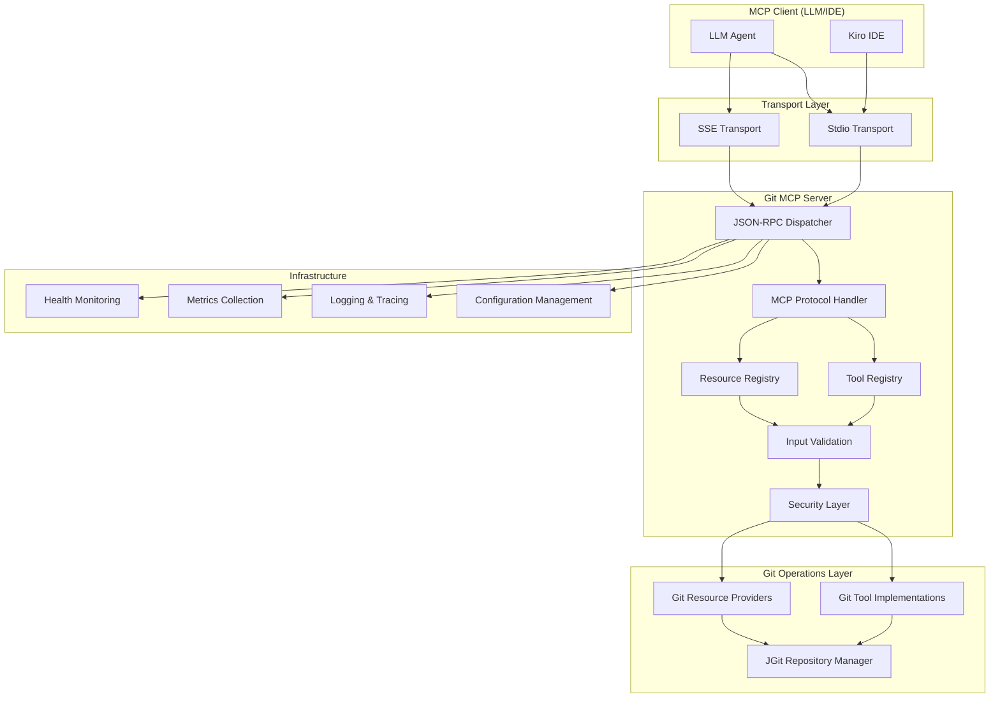

# Design Document: Git MCP Server

## Overview

The Git MCP Server is a production-grade Spring Boot application that implements the Model Context Protocol (MCP) JSON-RPC 2.0 specification to provide secure Git operations to Large Language Models (LLMs). The server acts as an intelligent bridge between LLMs and Git repositories, exposing Git functionality through MCP Tools and repository context through MCP Resources.

The architecture leverages Java 21's Virtual Threads for high-throughput I/O operations, JGit for pure Java Git operations, and Spring AI for structured LLM interactions. The server supports dual transport modes: Stdio for local IDE integration and Server-Sent Events (SSE) for remote HTTP-based communication.

Key design principles include stateless operation, comprehensive input validation, graceful error handling, and extensive observability through distributed tracing and metrics.

## Architecture

### High-Level Architecture



### Transport Architecture

The server supports two transport mechanisms:

1. **Stdio Transport**: For local IDE integration using standard input/output streams
2. **SSE Transport**: For remote HTTP-based communication using Server-Sent Events

Both transports converge on a common JSON-RPC dispatcher that handles MCP protocol messages uniformly.

### Threading Model

The server utilizes Java 21's Virtual Threads through Spring Boot 3.5's native support:
- Virtual threads handle all I/O operations without blocking platform threads
- Configured via `spring.threads.virtual.enabled=true`
- Enables handling thousands of concurrent Git operations with minimal resource overhead

## Components and Interfaces

### Core Components

#### 1. JSON-RPC Dispatcher
**Purpose**: Central message routing and protocol compliance
**Implementation**: Custom Spring component implementing MCP JSON-RPC 2.0 specification
**Key Responsibilities**:
- Parse and validate incoming JSON-RPC messages
- Route requests to appropriate handlers
- Format responses according to MCP specification
- Handle protocol errors and edge cases

```java
@Component
public class McpJsonRpcDispatcher {
    public McpResponse dispatch(McpRequest request, MessageContext context);
    public void handleNotification(McpNotification notification, MessageContext context);
}
```

#### 2. Tool Registry
**Purpose**: Manage and expose Git operations as MCP Tools
**Implementation**: Spring component with automatic tool discovery
**Key Responsibilities**:
- Register Git tool implementations
- Provide tool metadata and schemas
- Validate tool invocations
- Execute tools with proper error handling

```java
@Component
public class GitToolRegistry {
    public List<ToolDefinition> getAvailableTools();
    public ToolResult executeTool(String toolName, JsonNode parameters, MessageContext context);
}
```

#### 3. Resource Registry
**Purpose**: Expose Git repository data as MCP Resources
**Implementation**: Spring component with URI-based resource resolution
**Key Responsibilities**:
- Resolve resource URIs to Git data
- Provide read-only access to repository information
- Handle resource not found scenarios
- Cache frequently accessed resources

```java
@Component
public class GitResourceRegistry {
    public List<ResourceDefinition> getAvailableResources();
    public ResourceContent getResource(URI resourceUri, MessageContext context);
}
```

#### 4. JGit Repository Manager
**Purpose**: Centralized Git repository operations using JGit
**Implementation**: Spring service with repository lifecycle management
**Key Responsibilities**:
- Initialize and manage Git repository instances
- Provide thread-safe access to Git operations
- Handle repository state validation
- Manage repository cleanup and resource disposal

```java
@Service
public class JGitRepositoryManager {
    public Repository getRepository(Path repositoryPath);
    public GitStatus getStatus(Repository repo);
    public ObjectId commit(Repository repo, String message);
    public List<DiffEntry> getDiff(Repository repo, String fromRef, String toRef);
}
```

### Git Tool Implementations

#### GitStatusTool
**Schema**: No parameters required
**Returns**: Current working tree status with modified, staged, and untracked files
**Error Conditions**: Invalid repository path, repository access denied

#### GitCommitTool
**Schema**: 
```java
public record GitCommitRequest(String message, boolean allowEmpty) {}
```
**Returns**: Commit hash and summary information
**Error Conditions**: No staged changes, empty message, detached HEAD state

#### GitDiffTool
**Schema**:
```java
public record GitDiffRequest(
    Optional<String> fromRef,
    Optional<String> toRef,
    Optional<String> filePath
) {}
```
**Returns**: Unified diff format output
**Error Conditions**: Invalid commit references, file not found

#### GitBranchTool
**Schema**:
```java
public record GitBranchRequest(
    GitBranchOperation operation,
    Optional<String> branchName
) {}

public enum GitBranchOperation { LIST, CREATE, CHECKOUT }
```
**Returns**: Branch information based on operation
**Error Conditions**: Branch already exists, uncommitted changes during checkout

#### GitLogTool
**Schema**:
```java
public record GitLogRequest(
    Optional<Integer> limit,
    Optional<String> filePath,
    Optional<String> since
) {}
```
**Returns**: Commit history with metadata
**Error Conditions**: Invalid date format, file path not found

### Resource Implementations

#### Repository Info Resource
**URI**: `git-resource://repository-info`
**Content**: Repository metadata including current branch, HEAD commit, and path
**Format**: JSON structure with repository state information

#### File Content Resource
**URI**: `git-resource://file/{path}`
**Content**: File content at current HEAD
**Format**: Raw file content with appropriate MIME type detection

### Security and Validation Layer

#### Input Validation
**Implementation**: Custom validation using Java Records and Bean Validation
**Key Features**:
- Schema-based parameter validation
- Path traversal prevention
- Command injection protection
- Sanitization of user inputs

```java
@Component
public class GitInputValidator {
    public ValidationResult validateToolParameters(String toolName, JsonNode parameters);
    public boolean isValidRepositoryPath(Path path);
    public String sanitizeCommitMessage(String message);
}
```

#### Security Guardrails
**Implementation**: Spring Security integration with custom filters
**Key Features**:
- Repository access control through allowlist
- Input sanitization for all user-provided data
- Output sanitization to prevent information leakage
- Rate limiting for resource-intensive operations

## Data Models

### Core MCP Protocol Models

```java
// Base MCP message types
public sealed interface McpMessage permits McpRequest, McpResponse, McpNotification {}

public record McpRequest(
    String jsonrpc,
    String method,
    JsonNode params,
    String id
) implements McpMessage {}

public record McpResponse(
    String jsonrpc,
    JsonNode result,
    McpError error,
    String id
) implements McpMessage {}

public record McpNotification(
    String jsonrpc,
    String method,
    JsonNode params
) implements McpMessage {}
```

### Tool and Resource Models

```java
// Tool definitions and results
public record ToolDefinition(
    String name,
    String description,
    JsonSchema inputSchema
) {}

public record ToolResult(
    JsonNode content,
    boolean isError,
    Optional<String> errorMessage
) {}

// Resource definitions and content
public record ResourceDefinition(
    URI uri,
    String name,
    String description,
    String mimeType
) {}

public record ResourceContent(
    String content,
    String mimeType,
    Optional<Map<String, String>> metadata
) {}
```

### Git Operation Models

```java
// Git status representation
public record GitStatus(
    List<String> modified,
    List<String> staged,
    List<String> untracked,
    boolean isClean
) {}

// Git commit information
public record GitCommitInfo(
    String hash,
    String shortHash,
    String message,
    String author,
    Instant timestamp
) {}

// Git branch information
public record GitBranchInfo(
    String name,
    boolean isCurrent,
    String lastCommitHash,
    Instant lastCommitTime
) {}
```

### Configuration Models

```java
@ConfigurationProperties(prefix = "git.mcp")
public record GitMcpProperties(
    TransportConfig transport,
    SecurityConfig security,
    RepositoryConfig repository,
    ObservabilityConfig observability
) {}

public record TransportConfig(
    boolean stdioEnabled,
    boolean sseEnabled,
    int ssePort,
    Duration requestTimeout
) {}

public record SecurityConfig(
    List<String> allowedRepositories,
    boolean enableInputSanitization,
    int maxConcurrentOperations
) {}
```

## Correctness Properties

*A property is a characteristic or behavior that should hold true across all valid executions of a system—essentially, a formal statement about what the system should do. Properties serve as the bridge between human-readable specifications and machine-verifiable correctness guarantees.*

The following properties define the correctness requirements for the Git MCP Server, derived from the acceptance criteria in the requirements document. Each property is designed to be tested using property-based testing to ensure universal correctness across all valid inputs.

### Property 1: JSON-RPC Protocol Compliance
*For any* JSON-RPC message received by the server, the server should validate it according to MCP specification and return properly formatted responses with correct error codes for invalid messages.
**Validates: Requirements 1.1, 1.2, 1.3, 1.5**

### Property 2: Stdio Transport Logging Isolation
*For any* server configuration with Stdio transport enabled, all application logs should be redirected to System.err while JSON-RPC messages use System.out exclusively.
**Validates: Requirements 2.3**

### Property 3: Virtual Thread I/O Handling
*For any* I/O operation when Stdio transport is configured, the server should use Virtual Threads to handle blocking operations without stalling the application.
**Validates: Requirements 2.4**

### Property 4: Git Status Operations
*For any* valid Git repository, the git_status tool should return accurate working tree status with files correctly categorized as modified, staged, or untracked, and return appropriate errors for invalid repository paths.
**Validates: Requirements 3.1, 3.2, 3.4**

### Property 5: Git Commit Operations
*For any* Git repository with staged changes and valid commit message, the git_commit tool should create a commit and return the commit hash and summary, while rejecting empty messages and repositories with no staged changes.
**Validates: Requirements 4.1, 4.3, 4.4**

### Property 6: Git Diff Operations
*For any* valid Git repository and commit references, the git_diff tool should return unified diff format output for the specified comparison (unstaged changes, single ref vs HEAD, or two refs), with appropriate errors for invalid references.
**Validates: Requirements 5.1, 5.2, 5.3, 5.4, 5.5**

### Property 7: Git Branch Operations
*For any* valid Git repository, branch operations should correctly list branches with current branch indicated, create new branches from HEAD, and switch branches while handling error conditions for existing branch names and uncommitted changes.
**Validates: Requirements 6.1, 6.2, 6.3**

### Property 8: Git Log Operations
*For any* valid Git repository, the git_log tool should return commit history in reverse chronological order with complete metadata (hash, author, date, message), respecting limit and file path filters when specified.
**Validates: Requirements 7.1, 7.2, 7.3, 7.4**

### Property 9: Resource Access
*For any* valid resource URI, the server should return appropriate content for repository-info and file resources, with proper error handling for non-existent files and correct content structure.
**Validates: Requirements 8.2, 8.3, 8.4, 8.5**

### Property 10: Input Validation and Security
*For any* tool invocation, the server should validate parameters against schemas, reject path traversal attempts, sanitize malicious inputs, validate branch names, and enforce repository access controls through allowlists.
**Validates: Requirements 9.1, 9.2, 9.3, 9.4, 9.5**

### Property 11: Error Handling
*For any* error condition, the server should return human-readable error messages, translate exceptions to JSON-RPC errors without exposing stack traces, provide helpful error descriptions with corrective actions, use correct error codes, and handle timeouts appropriately.
**Validates: Requirements 10.1, 10.2, 10.3, 10.4, 10.5**

### Property 12: Schema Serialization
*For any* tool registration, the server should serialize Java Record schemas to JSON Schema format, correctly deserialize JSON arguments to Records, return appropriate errors for deserialization failures, and validate required fields.
**Validates: Requirements 11.2, 11.3, 11.4, 11.5**

### Property 13: Logging Behavior
*For any* request processing, the server should include TraceID and SpanID in log entries, forward log events as MCP notifications, support dynamic log level adjustment, and redirect logs to stderr when using Stdio transport.
**Validates: Requirements 12.2, 12.3, 12.4, 12.5**

### Property 14: Observability
*For any* server operation, the system should generate distributed traces, expose metrics for Git operation latency and success rates, track AI token usage when applicable, and disable sensitive logging in production environments.
**Validates: Requirements 13.1, 13.2, 13.3, 13.5**

### Property 15: Stateless Operation
*For any* sequence of requests, the server should not store session state between requests, rely on MCP protocol primitives for context, resume operation after restarts without state recovery, and handle concurrent requests independently.
**Validates: Requirements 14.1, 14.2, 14.3, 14.5**

### Property 16: Configuration Management
*For any* server startup, the system should support configuration from application.yml and environment variables, read API keys exclusively from environment variables, validate configuration and fail fast for missing required properties, and support profile-specific configurations.
**Validates: Requirements 15.2, 15.3, 15.4, 15.5**

## Error Handling

### Error Classification

The server implements a comprehensive error handling strategy with clear error classification:

#### Protocol Errors
- **Parse Errors (-32700)**: Invalid JSON in request
- **Invalid Request (-32600)**: Malformed JSON-RPC structure
- **Method Not Found (-32601)**: Unknown tool or resource
- **Invalid Params (-32602)**: Parameter validation failures
- **Internal Error (-32603)**: Server-side exceptions

#### Git Operation Errors
- **Repository Not Found**: Invalid or inaccessible repository path
- **Invalid Repository State**: Detached HEAD, merge conflicts, etc.
- **Permission Denied**: Insufficient access rights
- **Operation Failed**: Git command execution failures

#### Security Errors
- **Path Traversal Detected**: Malicious path parameters
- **Repository Access Denied**: Path not in allowlist
- **Input Validation Failed**: Malicious or invalid input detected

### Error Response Format

All errors follow the JSON-RPC 2.0 error response format:

```json
{
  "jsonrpc": "2.0",
  "error": {
    "code": -32603,
    "message": "Repository not found",
    "data": {
      "repositoryPath": "/invalid/path",
      "suggestion": "Verify the repository path exists and is accessible"
    }
  },
  "id": "request-id"
}
```

### Graceful Degradation

The server implements graceful degradation strategies:
- Failed operations return descriptive error messages instead of crashing
- Partial failures in batch operations report individual item status
- Resource unavailability doesn't prevent other operations
- Network timeouts are handled with appropriate retry suggestions

## Testing Strategy

### Dual Testing Approach

The Git MCP Server employs a comprehensive testing strategy combining unit tests and property-based tests:

#### Unit Tests
- **Specific Examples**: Test concrete scenarios with known inputs and expected outputs
- **Edge Cases**: Test boundary conditions, empty repositories, invalid states
- **Integration Points**: Test component interactions and Spring Boot configuration
- **Error Conditions**: Test specific error scenarios and exception handling

#### Property-Based Tests
- **Universal Properties**: Test properties that must hold for all valid inputs
- **Input Generation**: Use smart generators that create realistic Git repository states
- **Comprehensive Coverage**: Test across wide range of repository configurations
- **Regression Prevention**: Catch edge cases that manual testing might miss

### Testing Framework Configuration

**Property-Based Testing Library**: [jqwik](https://jqwik.net/) for Java
- Minimum 100 iterations per property test
- Custom generators for Git repository states
- Shrinking support for minimal failing examples

**Unit Testing Stack**:
- **JUnit 5 (Jupiter)** for test framework
- **AssertJ** for fluent assertions
- **Mockito** with strict stubbing for mocking
- **Testcontainers** for integration testing with real Git repositories

### Test Organization

```
src/test/java/
├── unit/                           # Unit tests
│   ├── tools/                      # Git tool implementations
│   ├── resources/                  # Resource providers
│   ├── protocol/                   # JSON-RPC protocol handling
│   └── security/                   # Input validation and security
├── integration/                    # Integration tests
│   ├── transport/                  # Transport layer tests
│   ├── endtoend/                   # Full workflow tests
│   └── configuration/              # Spring Boot configuration tests
└── properties/                     # Property-based tests
    ├── GitToolProperties.java      # Git operation properties
    ├── ProtocolProperties.java     # JSON-RPC protocol properties
    ├── SecurityProperties.java     # Security and validation properties
    └── ObservabilityProperties.java # Logging and metrics properties
```

### Property Test Examples

Each correctness property is implemented as a property-based test with appropriate tagging:

```java
@Property
@Tag("Feature: git-mcp-server, Property 4: Git Status Operations")
void gitStatusOperationsProperty(@ForAll("validRepositoryStates") RepositoryState state) {
    // Test implementation
}

@Property  
@Tag("Feature: git-mcp-server, Property 10: Input Validation and Security")
void inputValidationProperty(@ForAll("toolInvocations") ToolInvocation invocation) {
    // Test implementation
}
```

### Mutation Testing

**Tool**: PiTest configured via Gradle plugin
**Thresholds**:
- Mutation Coverage: Minimum 80%
- Test Strength: Minimum 85%
**Scope**: Logic-heavy layers (Services, Git operations, Protocol handling)
**Exclusions**: DTOs, Configuration classes, Spring Boot auto-configuration

### Performance Testing

**Load Testing**: Simulate high-throughput scenarios with multiple concurrent Git operations
**Memory Testing**: Verify Virtual Thread efficiency and memory usage patterns  
**Latency Testing**: Measure Git operation response times under various repository sizes
**Stress Testing**: Test behavior under resource constraints and error conditions

The testing strategy ensures that the Git MCP Server meets all correctness properties while maintaining high performance and reliability standards.