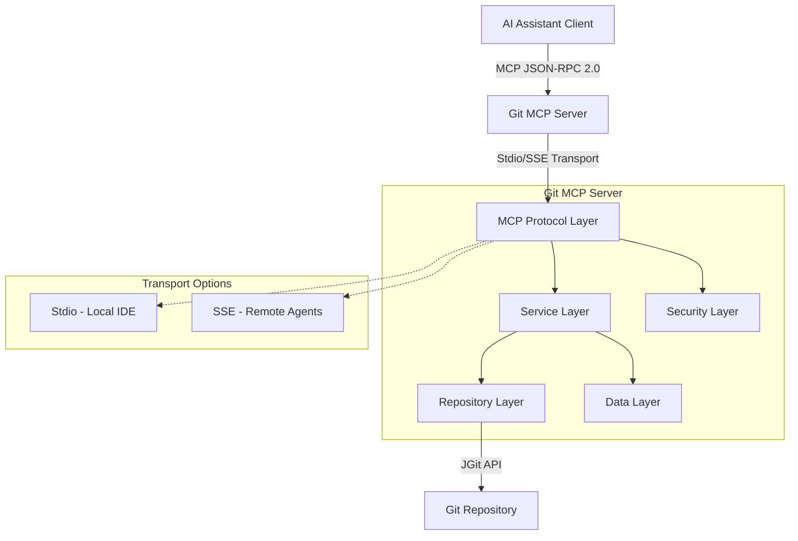

# Git MCP Server Design Document

## Overview

The Git MCP Server is a Java 21 application that bridges AI assistants with Git repositories through the Model Context Protocol (MCP). The server exposes Git operations as MCP tools, enabling AI-driven version control workflows while maintaining strict security and data integrity.

The architecture follows a layered approach with clear separation between MCP protocol handling, Git operations, and data serialization. The server uses JGit for Git operations, adheres to MCP JSON-RPC 2.0 specification, and follows modern Java 21 practices including Virtual Threads, Records, and Pattern Matching. The build system uses Gradle Kotlin DSL with comprehensive quality gates including mutation testing via PiTest.

## Architecture

### High-Level Architecture



### Transport Layer Strategy

**Local IDE Integration**: Uses Stdio transport with Java 21 Virtual Threads to handle blocking I/O on System.in/System.out without stalling the application loop.

**Remote Agent Integration**: Uses Server-Sent Events (SSE) for HTTP-based transport, leveraging Spring Boot's reactive capabilities.

**Protocol Compliance**: Strict adherence to MCP JSON-RPC 2.0 specification with stateless operation - context passed via protocol primitives, not server memory.

### Layer Architecture

1. **MCP Protocol Layer**: Handles JSON-RPC 2.0 communication, session management, and protocol compliance with strict output stream hygiene
2. **Security Layer**: Input validation, path traversal protection, and credential management
3. **Service Layer**: Orchestrates Git operations and manages business logic with Virtual Thread support
4. **Repository Layer**: Abstracts Git operations using JGit with comprehensive error handling
5. **Data Layer**: Handles serialization/deserialization using Java Records for immutable data structures

## Components and Interfaces

### Core Components

#### MCPServerController

- **Purpose**: Entry point for MCP protocol messages with strict JSON-RPC 2.0 compliance
- **Responsibilities**: 
  - Handle JSON-RPC 2.0 requests/responses with proper error code mapping
  - Manage stateless client sessions
  - Route requests to appropriate services
  - Maintain output stream hygiene (System.out for protocol, System.err for logs)
- **Key Methods**:
  - `handleToolCall(ToolCallRequest): ToolCallResponse`
  - `initializeSession(InitRequest): InitResponse`
  - `listTools(): ToolListResponse`
- **Security**: Input validation against Java Record schemas, path traversal protection

#### GitOperationService

- **Purpose**: Orchestrates Git operations with Virtual Thread support for I/O operations
- **Responsibilities**:
  - Coordinate complex Git workflows using Virtual Threads
  - Handle error scenarios with structured JSON-RPC error responses
  - Manage transaction boundaries and resource cleanup
  - Implement confirmation loops for high-stakes operations
- **Key Methods**:
  - `executeGitOperation(GitOperationRequest): GitOperationResult`
  - `validateRepository(String path): ValidationResult`
  - `confirmHighStakesOperation(OperationRequest): ConfirmationResult`

#### GitRepository (Interface)

- **Purpose**: Abstract Git operations for testability with comprehensive error handling
- **Implementations**: JGitRepository
- **Security**: Directory allowlist enforcement, path validation
- **Key Methods**:
  - `init(String path): Repository`
  - `clone(String url, String path): Repository`
  - `commit(String message, List<String> files): CommitResult`
  - `createBranch(String name): BranchResult`
  - `merge(String branchName): MergeResult`

#### DataSerializer

- **Purpose**: Handle JSON serialization/deserialization using Java Records for type safety
- **Responsibilities**:
  - Convert Git objects to/from JSON using immutable Records
  - Validate data integrity with strict typing
  - Handle round-trip consistency with proper error mapping
- **Key Methods**:
  - `serialize(GitObject): JsonNode`
  - `deserialize(JsonNode, Class<T>): T`
  - `validateSchema(JsonNode, RecordClass): ValidationResult`

### Interface Definitions

```java
public interface GitRepository {
    Repository init(String path) throws GitException;
    Repository clone(String url, String path, CredentialsProvider credentials) throws GitException;
    Status getStatus(Repository repo) throws GitException;
    void add(Repository repo, List<String> filePatterns) throws GitException;
    RevCommit commit(Repository repo, String message) throws GitException;
    Ref createBranch(Repository repo, String branchName) throws GitException;
    void checkout(Repository repo, String branchName) throws GitException;
    List<Ref> listBranches(Repository repo) throws GitException;
    MergeResult merge(Repository repo, String branchName) throws GitException;
    void push(Repository repo, CredentialsProvider credentials) throws GitException;
    void pull(Repository repo, CredentialsProvider credentials) throws GitException;
    
    // Security validation
    ValidationResult validatePath(String path);
    boolean isPathAllowed(String path);
}

public interface MCPProtocolHandler {
    void handleRequest(JsonRpcRequest request, JsonRpcResponse response);
    void initializeSession(String clientId, Map<String, Object> capabilities);
    List<ToolDefinition> getAvailableTools();
    
    // Logging integration
    void forwardLogToMCP(LogLevel level, String message);
    void setDynamicLogLevel(LogLevel level);
}

public interface SecurityValidator {
    ValidationResult validateToolInput(String toolName, Object input);
    boolean requiresConfirmation(String toolName, Object input);
    CredentialsProvider sanitizeCredentials(CredentialsProvider credentials);
}
```

## Data Models

### Core Data Models (Java Records)

All data models use Java Records for immutability and precise serialization:

#### GitOperationRequest

```java
public record GitOperationRequest(
    String operation,           // "init", "clone", "commit", etc.
    String repositoryPath,      // Local repository path
    Map<String, Object> parameters, // Operation-specific parameters
    Optional<CredentialsProvider> credentials // Authentication info
) {
    // Validation methods
    public ValidationResult validate() { /* ... */ }
}
```

#### GitOperationResult

```java
public record GitOperationResult(
    boolean success,
    String message,
    Map<String, Object> data,   // Operation-specific result data
    List<String> errors,        // Error details if any
    Optional<String> confirmationRequired // For high-stakes operations
) {}
```

#### RepositoryStatus

```java
public record RepositoryStatus(
    List<String> stagedFiles,
    List<String> unstagedFiles,
    List<String> untrackedFiles,
    String currentBranch,
    boolean hasUncommittedChanges,
    Optional<ConflictInfo> conflicts
) {}
```

#### CommitInfo

```java
public record CommitInfo(
    String hash,
    String message,
    String author,
    String email,
    Instant timestamp,
    List<String> parentHashes
) {}
```

### MCP Protocol Models (Java Records)

#### ToolDefinition

```java
public record ToolDefinition(
    String name,
    String description,
    JsonSchema inputSchema,     // JSON Schema for parameters
    boolean requiresConfirmation,
    List<String> allowedPaths   // Security constraint
) {}
```

#### ToolCallRequest

```java
public record ToolCallRequest(
    String toolName,
    Map<String, Object> arguments,
    String requestId,
    Optional<String> confirmationToken
) {}
```

### Security Models

#### ValidationResult

```java
public record ValidationResult(
    boolean isValid,
    List<String> errors,
    SecurityLevel requiredLevel
) {}
```

#### SecurityContext

```java
public record SecurityContext(
    String clientId,
    List<String> allowedPaths,
    Set<String> permissions,
    SecurityLevel level
) {}
```

## Security Architecture

### Input Validation and Sanitization

**Strict Typing**: All incoming JSON-RPC arguments validated against Java Record schemas before execution.

**Path Traversal Protection**: Directory allowlist enforcement with rejection of paths containing `..` or absolute paths outside sandbox.

**Credential Management**: Secure handling of authentication credentials with sanitization and no exposure in logs.

### Confirmation Loops

**High-Stakes Operations**: Tools that modify code, delete files, or execute system commands implement confirmation capability requiring explicit user consent.

**Operation Classification**: Automatic detection of operations requiring confirmation based on impact assessment.

### Error Handling Security

**Information Disclosure**: JSON-RPC errors use standard error codes without leaking Java stack traces in error messages.

**Graceful Degradation**: Failed operations return human-readable error strings allowing AI model self-correction rather than session crashes.

## Logging and Diagnostics

### Output Stream Hygiene

**Protocol Compliance**: System.out strictly reserved for JSON-RPC protocol messages to prevent corruption.

**Log Redirection**: All application logs (Spring Boot startup, SLF4J output) configured to write to System.err.

### MCP Protocol Logging

**Bridge Implementation**: Custom SLF4J Appender forwards log events to MCP Host using `notifications/message` capability.

**Level Mapping**: Direct mapping of SLF4J levels (INFO, WARN, ERROR) to MCP logging levels.

**Dynamic Management**: Runtime log level adjustment via system tool without server restart.

## Correctness Properties

*A property is a characteristic or behavior that should hold true across all valid executions of a system-essentially, a formal statement about what the system should do. Properties serve as the bridge between human-readable specifications and machine-verifiable correctness guarantees.*

Based on the prework analysis, I need to perform property reflection to eliminate redundancy before writing the final properties:

**Property Reflection:**
- Properties 1.1-1.5 (MCP connection handling) can be consolidated into comprehensive session management properties
- Properties 2.1-2.5 (basic Git operations) are distinct and should remain separate
- Properties 3.1-3.5 (branch operations) are distinct and should remain separate  
- Properties 4.1-4.5 (remote operations) are distinct and should remain separate
- Properties 5.1, 5.3, and 5.5 can be consolidated into a comprehensive serialization round-trip property
- Properties 5.2 and 5.4 (parsing validation) can be combined into one validation property
- Properties 6.1-6.5 (error handling) can be consolidated into comprehensive error response properties

### Session Management Properties

Property 1: MCP session lifecycle management
*For any* valid AI assistant client, establishing an MCP connection should result in a valid authenticated session that can handle protocol messages and clean up resources upon disconnection
**Validates: Requirements 1.1, 1.2, 1.4, 1.5**

Property 2: Authentication failure handling
*For any* invalid client credentials, connection attempts should be rejected with appropriate error messages
**Validates: Requirements 1.3**

### Git Operation Properties

Property 3: Repository initialization
*For any* valid file system path, initializing a Git repository should create a functional repository at that location
**Validates: Requirements 2.1**

Property 4: Repository cloning
*For any* valid Git URL and local path, cloning should create a complete local copy of the remote repository
**Validates: Requirements 2.2**

Property 5: Repository status reporting
*For any* Git repository state, status requests should return accurate information about staged, unstaged, and untracked files
**Validates: Requirements 2.3**

Property 6: File staging
*For any* valid file paths in a repository, adding them should stage the files for commit
**Validates: Requirements 2.4**

Property 7: Commit creation
*For any* valid commit message and staged changes, creating a commit should produce a new commit with those changes
**Validates: Requirements 2.5**

### Branch Management Properties

Property 8: Branch creation
*For any* valid branch name, creating a branch should result in a new branch that can be checked out
**Validates: Requirements 3.1**

Property 9: Branch checkout
*For any* existing branch, checking it out should switch the working directory to that branch
**Validates: Requirements 3.2**

Property 10: Branch listing
*For any* repository, listing branches should return all local and remote branches with accurate status information
**Validates: Requirements 3.3**

Property 11: Commit history retrieval
*For any* repository and log configuration, retrieving commit history should return commits according to the specified depth and format
**Validates: Requirements 3.4**

Property 12: Branch merging
*For any* valid source and target branch combination, merging should integrate changes from source into target branch
**Validates: Requirements 3.5**

### Remote Operation Properties

Property 13: Push operations
*For any* repository with local commits, pushing should transfer commits to the configured remote repository
**Validates: Requirements 4.1**

Property 14: Pull operations
*For any* repository with remote changes, pulling should fetch and merge remote changes into the local branch
**Validates: Requirements 4.2**

Property 15: Fetch operations
*For any* repository with remote changes, fetching should retrieve remote changes without modifying the working directory
**Validates: Requirements 4.3**

Property 16: Credential handling
*For any* remote operation requiring authentication, credentials should be handled securely without exposure
**Validates: Requirements 4.4**

Property 17: Conflict reporting
*For any* remote operation that encounters conflicts, detailed conflict information should be returned to enable resolution
**Validates: Requirements 4.5**

### Serialization Properties

Property 18: Git data serialization round-trip
*For any* Git object, serializing to JSON and then deserializing should produce an equivalent object with all essential metadata preserved
**Validates: Requirements 5.1, 5.3, 5.5**

Property 19: Git data validation
*For any* MCP request containing Git data, parsing should validate the data against Git specifications and return specific error messages for invalid data
**Validates: Requirements 5.2, 5.4**

### Error Handling Properties

Property 20: Structured error responses
*For any* Git operation failure, the response should contain structured error information with specific error codes and descriptive messages
**Validates: Requirements 6.1, 6.3**

Property 21: Error logging and classification
*For any* system error or repository access failure, detailed error information should be logged and errors should be properly classified by type
**Validates: Requirements 6.2, 6.4**

Property 22: Graceful failure handling
*For any* unexpected system state, the server should fail gracefully while maintaining system stability
**Validates: Requirements 6.5**

### Configuration Properties

Property 23: External configuration support
*For any* valid configuration file or environment variable, the server should properly load and apply the configuration settings
**Validates: Requirements 7.4**

## Error Handling

### Error Classification

The system implements a hierarchical error classification:

1. **Protocol Errors**: MCP protocol violations, malformed requests
2. **Authentication Errors**: Invalid credentials, authorization failures  
3. **Git Errors**: Repository not found, merge conflicts, invalid operations
4. **System Errors**: File system issues, network failures, resource exhaustion

### Error Response Format

```java
public record ErrorResponse(
    String errorCode,        // Standardized JSON-RPC error code
    String message,          // Human-readable description
    Map<String, Object> details, // Context-specific error details
    String timestamp,        // ISO 8601 timestamp
    String requestId,        // Original request identifier
    Optional<String> correlationId // For error tracking
) {}
```

### Error Handling Strategies

- **Validation Errors**: Return immediately with specific validation messages
- **Git Operation Errors**: Wrap JGit exceptions with contextual information
- **Network Errors**: Implement retry logic with exponential backoff
- **Resource Errors**: Graceful degradation and resource cleanup

## Testing Strategy

### Comprehensive Testing Approach

The Git MCP Server implements a multi-layered testing strategy following TDD principles:

**Red-Green-Refactor**: All code generation follows the TDD cycle - fail first, pass simple, refactor safely.

**Testing Stack**:
- **Framework**: JUnit 5 (Jupiter) for all test execution
- **Assertions**: AssertJ for fluent, readable assertions
- **Mocking**: Mockito with strict stubbing enabled
- **Property Testing**: jqwik for universal property validation with JUnit 5 integration

### Unit Testing Strategy

**Mechanics vs Intelligence**: Unit tests verify mechanics (prompt template rendering, data transformations) not intelligence (creative quality).

**Determinism**: Tests remain deterministic and fast through proper mocking and controlled inputs.

**Coverage Areas**:
- Specific examples demonstrating correct behavior
- Edge cases like empty repositories, invalid paths, network timeouts
- Integration points between MCP protocol and Git operations
- Error conditions and exception handling

### Property-Based Testing

**Framework**: jqwik for comprehensive property validation, providing seamless JUnit 5 integration.

**Configuration**: Each property-based test runs minimum 100 iterations for adequate random input coverage.

**Test Tagging**: Each property-based test includes comment with exact format:
`**Feature: git-mcp-server, Property {number}: {property_text}**`

**Implementation Requirements**:
- Each correctness property implemented by single property-based test using `@Property` annotation
- Tests generate appropriate random inputs using jqwik's `Arbitrary` generators
- Tests validate universal properties without excessive mocking
- Focus on core logic with smart generators constraining input space intelligently

### Mutation Testing

**Tool**: PiTest configured via Gradle plugin `info.solidsoft.pitest`

**Philosophy**: Code coverage insufficient - tests must detect code changes ("mutants")

**Quality Gates**:
- Mutation Coverage: Minimum 80%
- Test Strength: Minimum 85%
- Scope: Logic-heavy layers (Services, Domain logic), excluding DTOs and Configuration

### Integration Testing

**Slicing Strategy**: Prefer `@WebMvcTest` or `@DataJpaTest` over full `@SpringBootTest` where possible.

**Test Containers**: Mandatory use of Testcontainers for external dependencies requiring real integration testing.

### Test Data Management

- **Repository Fixtures**: Temporary test repositories with known states
- **Mock Remote Repositories**: Local Git repositories simulating remote operations  
- **Credential Mocking**: Test credentials without real authentication
- **Network Simulation**: Mock network conditions for remote operation testing