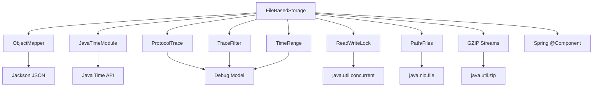
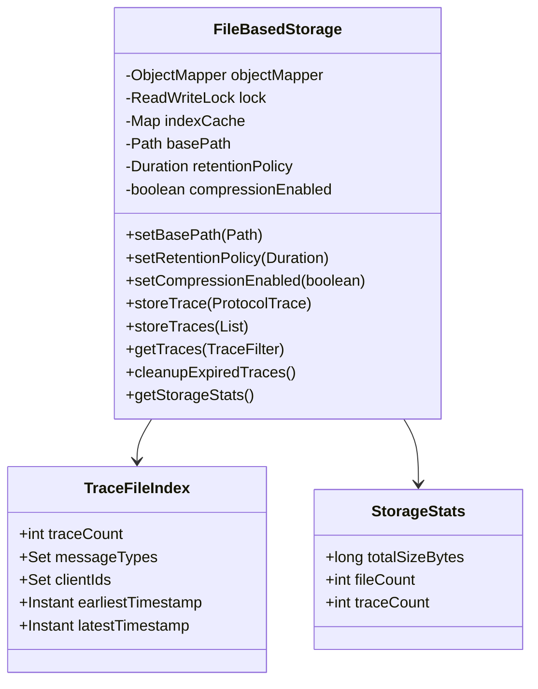
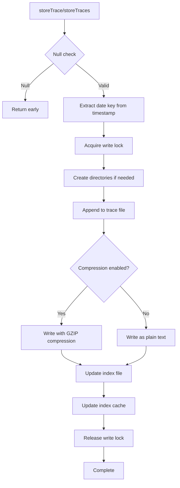
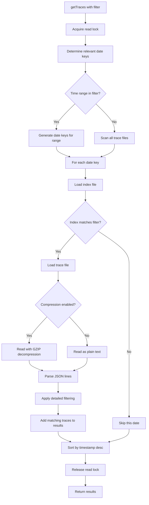
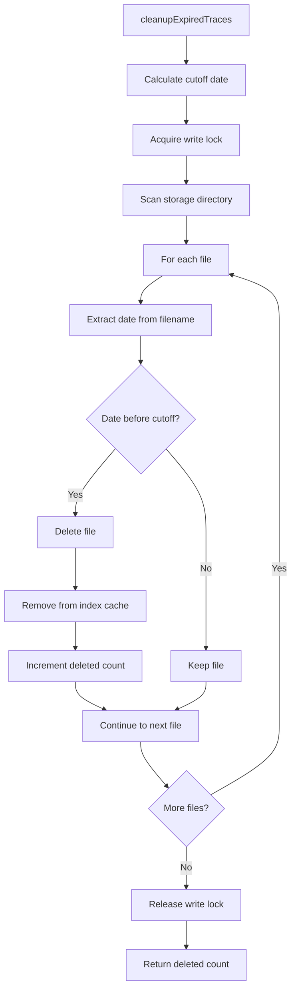
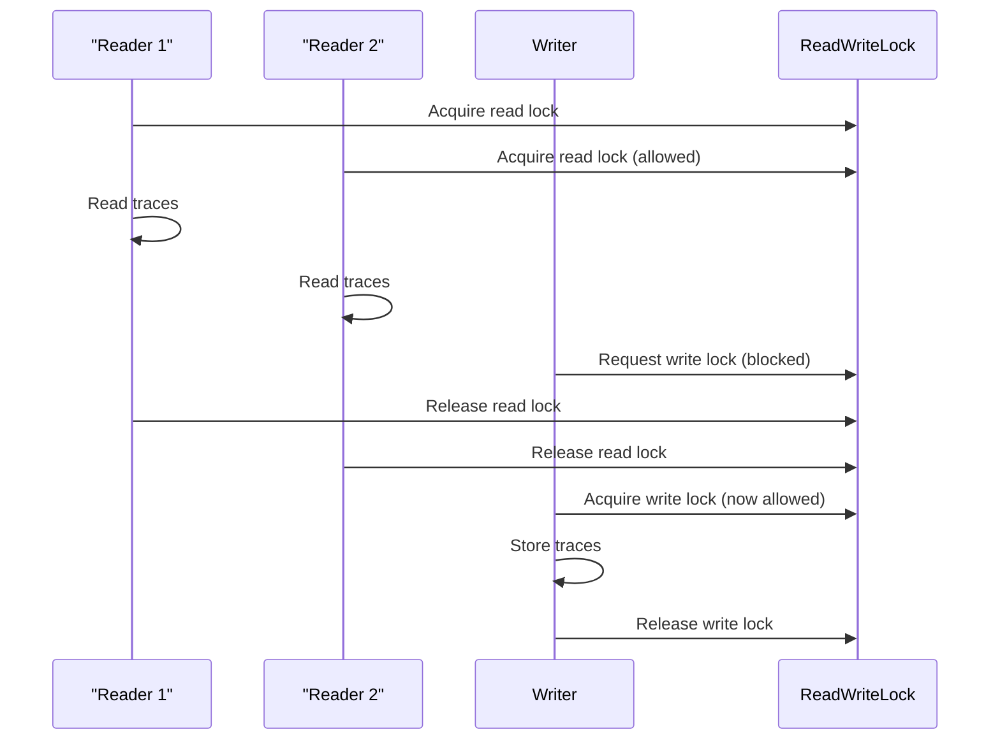

# FileBasedStorage Class Documentation

## Overview

The `FileBasedStorage` class is a Spring component that provides persistent storage for MCP protocol traces using a file-based approach. It implements compressed archives with searchable indexes and configurable retention policies, making it suitable for long-term storage and historical analysis of debugging data.

## Key Features

- **Date-based Organization**: Traces are organized by date for efficient retrieval
- **Compression Support**: Optional GZIP compression to reduce storage space
- **Searchable Indexes**: Fast filtering using metadata indexes
- **Batch Operations**: Optimized batch storage for better performance
- **Configurable Retention**: Automatic cleanup of expired traces
- **Thread Safety**: Concurrent read/write operations with ReadWriteLock
- **Index Caching**: In-memory caching of index files for performance

## Class Structure

### Dependencies



### Internal Data Structures



## Public Methods

### Configuration Methods

#### `setBasePath(Path basePath)`
**Purpose**: Sets the base directory path for storage files  
**Parameters**: 
- `basePath`: Path object representing the storage directory
**Behavior**: 
- Creates the directory if it doesn't exist
- Throws RuntimeException if directory creation fails
**Thread Safety**: Not thread-safe, should be called during initialization

#### `setRetentionPolicy(Duration retention)`
**Purpose**: Configures how long traces are kept before cleanup  
**Parameters**: 
- `retention`: Duration object (must be positive)
**Validation**: 
- Throws IllegalArgumentException for null or negative durations
**Thread Safety**: Thread-safe

#### `setCompressionEnabled(boolean enabled)`
**Purpose**: Enables or disables GZIP compression for stored files  
**Parameters**: 
- `enabled`: Boolean flag for compression
**Impact**: 
- Reduces storage space when enabled
- Slightly increases CPU usage for compression/decompression
**Thread Safety**: Thread-safe

### Storage Operations

#### `storeTrace(ProtocolTrace trace)`
**Purpose**: Stores a single protocol trace to persistent storage  
**Parameters**: 
- `trace`: ProtocolTrace object to store
**Behavior**: 
- Organizes traces by date (YYYY-MM-DD format)
- Appends to existing daily file or creates new one
- Updates searchable index with trace metadata
- Uses write lock for thread safety
**File Structure**: 
- Trace file: `YYYY-MM-DD.traces.gz`
- Index file: `YYYY-MM-DD.index.json`

#### `storeTraces(List<ProtocolTrace> traces)`
**Purpose**: Stores multiple traces in a batch operation for better performance  
**Parameters**: 
- `traces`: List of ProtocolTrace objects
**Optimization**: 
- Groups traces by date to minimize file operations
- Single write lock acquisition for entire batch
- Bulk index updates
**Performance**: Significantly faster than individual `storeTrace()` calls

### Retrieval Operations

#### `getTraces(TraceFilter filter)`
**Purpose**: Retrieves traces matching the specified filter criteria  
**Parameters**: 
- `filter`: TraceFilter object with search criteria
**Returns**: List of ProtocolTrace objects sorted by timestamp (newest first)
**Optimization Strategy**:
1. Determines relevant date files based on time range
2. Uses index files for quick filtering
3. Only loads and parses files that might contain matching traces
4. Applies detailed filtering on loaded traces

**Filter Criteria Supported**:
- Time range filtering
- Client ID filtering  
- Message type filtering
- Error-only filtering

### Maintenance Operations

#### `cleanupExpiredTraces()`
**Purpose**: Removes traces older than the configured retention policy  
**Returns**: Integer count of deleted files
**Behavior**: 
- Calculates cutoff date based on retention policy
- Deletes both trace files and index files
- Removes entries from index cache
- Uses write lock for thread safety
**Scheduling**: Should be called periodically (e.g., daily cron job)

#### `getStorageStats()`
**Purpose**: Provides statistics about current storage usage  
**Returns**: StorageStats record with:
- `totalSizeBytes`: Total disk space used
- `fileCount`: Number of trace files
- `traceCount`: Total number of stored traces
**Use Cases**: 
- Monitoring storage growth
- Capacity planning
- Performance analysis

## File Organization

### Directory Structure

```text
debug-data/
├── 2024-12-15.traces.gz     # Compressed trace data
├── 2024-12-15.index.json    # Searchable index
├── 2024-12-16.traces.gz
├── 2024-12-16.index.json
└── ...
```

### File Formats

#### Trace File Format
- **Uncompressed**: JSONL (JSON Lines) format
- **Compressed**: GZIP-compressed JSONL
- **Structure**: One JSON object per line, each representing a ProtocolTrace

#### Index File Format
```json
{
  "traceCount": 1250,
  "messageTypes": ["tool-invocation", "resource-request"],
  "clientIds": ["client-123", "client-456"],
  "earliestTimestamp": "2024-12-15T00:00:00Z",
  "latestTimestamp": "2024-12-15T23:59:59Z"
}
```

## Flow Diagrams

### Storage Flow



### Retrieval Flow



### Cleanup Flow



## Thread Safety

### Locking Strategy
- **ReadWriteLock**: Allows multiple concurrent readers or single writer
- **Read Operations**: `getTraces()`, `getStorageStats()` use read lock
- **Write Operations**: `storeTrace()`, `storeTraces()`, `cleanupExpiredTraces()` use write lock
- **Configuration**: Setter methods are not synchronized (initialization only)

### Concurrent Access Patterns


## Performance Considerations

### Optimization Strategies
1. **Index-based Filtering**: Quick elimination of irrelevant files
2. **Batch Operations**: Reduced lock contention and I/O operations
3. **Index Caching**: In-memory cache for frequently accessed indexes
4. **Date-based Partitioning**: Limits search scope for time-range queries
5. **Compression**: Reduces I/O and storage costs

### Memory Usage
- **Index Cache**: Bounded by number of unique dates
- **Streaming**: Large files processed line-by-line
- **Batch Size**: Configurable batch sizes prevent memory exhaustion

### I/O Patterns
- **Sequential Writes**: Append-only operations for optimal disk performance
- **Selective Reads**: Only reads files that might contain matching data
- **Compression Trade-off**: CPU vs. I/O and storage space

## Error Handling

### Exception Types
- **RuntimeException**: Wraps I/O errors with contextual information
- **IllegalArgumentException**: Invalid configuration parameters
- **IOException**: File system operations (wrapped in RuntimeException)

### Recovery Strategies
- **Corrupted Index**: Rebuilds index from trace file if needed
- **Corrupted Trace Lines**: Skips individual corrupted lines, continues processing
- **Missing Directories**: Automatically creates required directories
- **File Access Errors**: Fails fast with descriptive error messages

## Configuration Examples

### Basic Configuration
```java
FileBasedStorage storage = new FileBasedStorage();
storage.setBasePath(Paths.get("/var/log/mcp-debug"));
storage.setRetentionPolicy(Duration.ofDays(30));
storage.setCompressionEnabled(true);
```

### Production Configuration
```java
// High-performance production setup
storage.setBasePath(Paths.get("/fast-ssd/mcp-traces"));
storage.setRetentionPolicy(Duration.ofDays(90));
storage.setCompressionEnabled(true); // Save storage space

// Schedule cleanup
ScheduledExecutorService scheduler = Executors.newScheduledThreadPool(1);
scheduler.scheduleAtFixedRate(
    storage::cleanupExpiredTraces,
    0, 24, TimeUnit.HOURS
);
```

This implementation provides a robust, scalable solution for persistent trace storage with excellent performance characteristics and operational flexibility.