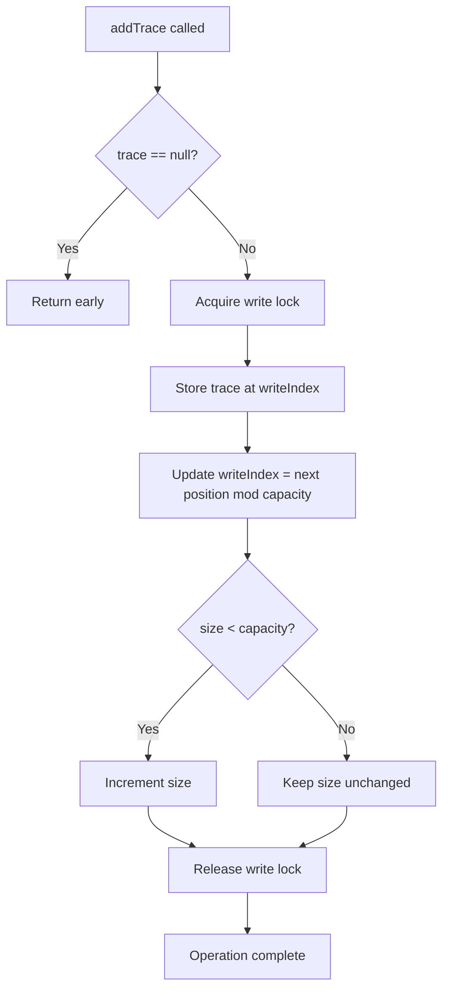
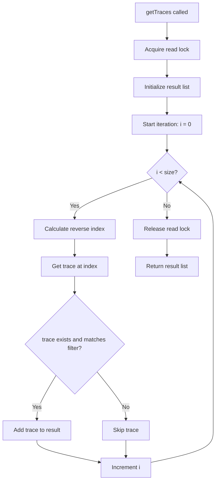
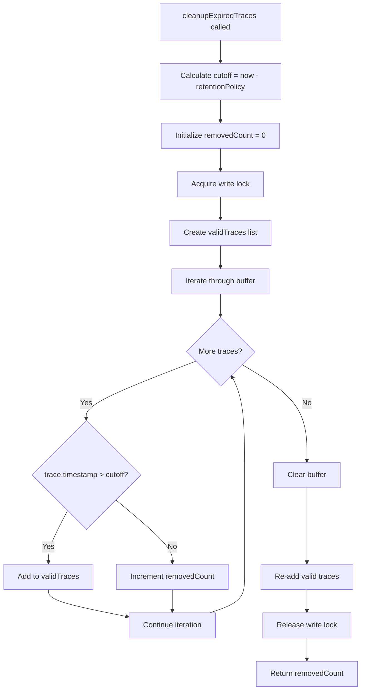
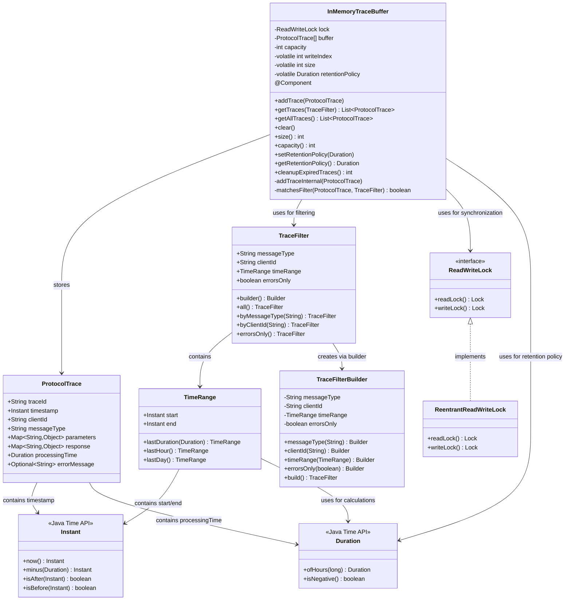

# InMemoryTraceBuffer Class Documentation

## Overview

The `InMemoryTraceBuffer` class is a thread-safe ring buffer implementation designed for storing protocol traces in memory. It provides configurable size and retention policy with concurrent access support for the Git MCP Server's debugging and monitoring capabilities.

## Class Description

The `InMemoryTraceBuffer` is a Spring component that implements a circular buffer pattern to efficiently store and retrieve `ProtocolTrace` objects. It uses a fixed-size array with write index management to overwrite the oldest traces when the buffer reaches capacity.

### Key Features

- **Thread-Safe Operations**: Uses ReadWriteLock for concurrent access
- **Ring Buffer Implementation**: Efficient memory usage with fixed capacity
- **Configurable Retention Policy**: Time-based trace expiration
- **Filtering Support**: Advanced trace filtering capabilities
- **Manual Cleanup**: Explicit expired trace removal

## Public Methods

### Constructors

#### `InMemoryTraceBuffer()`

Creates a trace buffer with default capacity of 10,000 traces.

**Usage:**

```java
InMemoryTraceBuffer buffer = new InMemoryTraceBuffer();
```

#### `InMemoryTraceBuffer(int capacity)`

Creates a trace buffer with specified capacity.

**Parameters:**

- `capacity` - Maximum number of traces to store (must be positive)

**Throws:**

- `IllegalArgumentException` - If capacity is not positive

**Usage:**

```java
InMemoryTraceBuffer buffer = new InMemoryTraceBuffer(5000);
```

### Core Operations

#### `addTrace(ProtocolTrace trace)`

Adds a protocol trace to the buffer. If buffer is full, overwrites the oldest trace.

**Parameters:**

- `trace` - The protocol trace to add (null traces are ignored)

**Behavior:**

- Thread-safe write operation
- Circular buffer overwrite when full
- Atomic size and index updates

#### `getTraces(TraceFilter filter)`

Retrieves all traces that match the given filter criteria.

**Parameters:**

- `filter` - Filter criteria for traces

**Returns:**

- `List<ProtocolTrace>` - Matching traces ordered by timestamp (newest first)

**Features:**

- Thread-safe read operation
- Reverse chronological ordering
- Comprehensive filtering support

#### `getAllTraces()`

Retrieves all traces in the buffer without filtering.

**Returns:**

- `List<ProtocolTrace>` - All traces ordered by timestamp (newest first)

#### `clear()`

Removes all traces from the buffer and resets internal state.

**Behavior:**

- Thread-safe write operation
- Nullifies all buffer entries
- Resets size and write index

### Buffer Information

#### `size()`

Gets the current number of traces in the buffer.

**Returns:**

- `int` - Current number of stored traces

#### `capacity()`

Gets the maximum capacity of the buffer.

**Returns:**

- `int` - Maximum buffer capacity

### Retention Policy Management

#### `setRetentionPolicy(Duration retention)`

Sets the retention policy for traces.

**Parameters:**

- `retention` - Retention duration (must be positive)

**Throws:**

- `IllegalArgumentException` - If retention is null or negative

#### `getRetentionPolicy()`

Gets the current retention policy.

**Returns:**

- `Duration` - Current retention duration

#### `cleanupExpiredTraces()`

Removes expired traces based on the retention policy.

**Returns:**

- `int` - Number of traces removed

**Behavior:**

- Manual cleanup operation
- Thread-safe write operation
- Rebuilds buffer without expired traces

## Flow Diagrams

### Add Trace Flow



### Get Traces Flow



### Cleanup Expired Traces Flow



## Dependencies Diagram



## Thread Safety

The `InMemoryTraceBuffer` implements thread safety through:

### ReadWriteLock Strategy

- **Read Operations**: Multiple concurrent readers allowed
- **Write Operations**: Exclusive access required
- **Lock Granularity**: Method-level locking

### Volatile Fields

- `writeIndex`: Ensures visibility of write position
- `size`: Ensures visibility of current buffer size
- `retentionPolicy`: Ensures visibility of policy changes

### Atomic Operations

- Buffer updates are atomic within write locks
- Index calculations use modulo arithmetic for wraparound
- Size management prevents race conditions

## Performance Characteristics

### Time Complexity

- **Add Trace**: O(1) - Constant time insertion
- **Get Traces**: O(n) - Linear scan with filtering
- **Clear**: O(n) - Must nullify all entries
- **Cleanup**: O(n) - Must scan and rebuild buffer

### Space Complexity

- **Memory Usage**: O(capacity) - Fixed array size
- **Additional Storage**: O(1) - Minimal overhead

### Concurrency Performance

- **Read Scalability**: High - Multiple concurrent readers
- **Write Contention**: Minimal - Fast write operations
- **Lock Overhead**: Low - Efficient ReadWriteLock implementation

## Usage Examples

### Basic Usage

```java
// Create buffer with default capacity
InMemoryTraceBuffer buffer = new InMemoryTraceBuffer();

// Add traces
ProtocolTrace trace = new ProtocolTrace(
    "trace-001",
    Instant.now(),
    "client-123",
    "git-status",
    Map.of("repository", "/path/to/repo"),
    Map.of("status", "clean"),
    Duration.ofMillis(150),
    Optional.empty()
);
buffer.addTrace(trace);

// Retrieve all traces
List<ProtocolTrace> allTraces = buffer.getAllTraces();

// Filter traces by message type
TraceFilter filter = TraceFilter.byMessageType("git-status");
List<ProtocolTrace> statusTraces = buffer.getTraces(filter);
```

### Advanced Filtering

```java
// Complex filter with multiple criteria
TraceFilter complexFilter = TraceFilter.builder()
    .messageType("git-commit")
    .clientId("client-123")
    .timeRange(TimeRange.lastHour())
    .errorsOnly(false)
    .build();

List<ProtocolTrace> filteredTraces = buffer.getTraces(complexFilter);
```

### Retention Management

```java
// Set 2-hour retention policy
buffer.setRetentionPolicy(Duration.ofHours(2));

// Manual cleanup
int removedCount = buffer.cleanupExpiredTraces();
System.out.println("Removed " + removedCount + " expired traces");
```

## Integration Points

### Spring Framework

- Annotated with `@Component` for dependency injection
- Singleton scope by default
- Can be autowired into other components

### Debug System

- Central storage for protocol traces
- Integrates with trace collection mechanisms
- Supports debugging and monitoring workflows

### MCP Protocol

- Stores traces of MCP message exchanges
- Supports protocol analysis and debugging
- Enables performance monitoring
